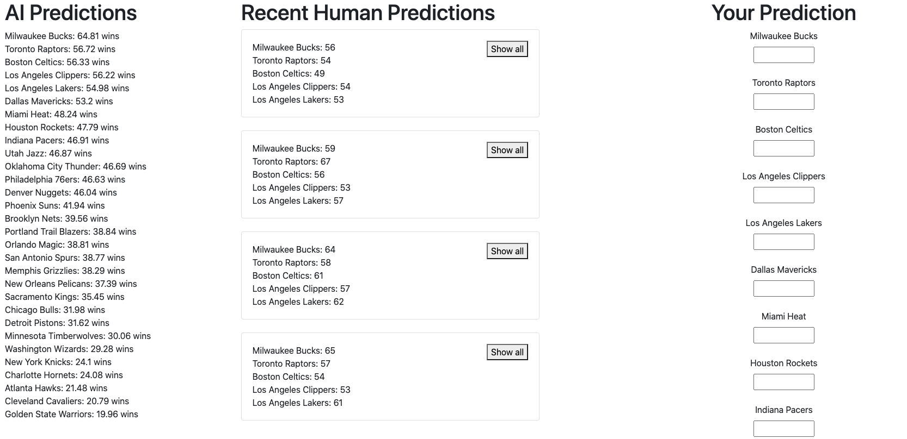

# NBAPredict: Available at [nbapredictai.herokuapp.com](https://nbapredictai.herokuapp.com)

This Flask/Bootstrap/Heroku app compares human predictions versus AI predictions of NBA standings at the end of the season.  

First, a scikit-learn linear regression model was trained using advanced statistics from the 1997 season to the 2019 season, excluding lockout years (all data from [basketball-reference.com](https://basketball-reference.com)). There were 15 inputs for each team ([advancedstats.csv](advancedstats.csv)):

* Offensive rating
* Defensive rating
* Net rating
* Pace
* Free throw attempt rate
* 3-pointer attempt rate
* True shooting percentage
* Effective field goal percentage
* Turnover Percentage
* Offensive rebound percentage
* Free throws per field goal attempt
* Opponent effective field goal percentage
* Opponent turnover percentage
* Defensive rebound percentage
* Opponent free throws per field goal attempt

The output was simply the number of wins the team achieved ([wins.csv](wins.csv)). 

Before every NBA team finishes playing 10 games, both users and the AI are allowed to make predictions for the final record of each team. The users manually enter their predictions, while the AI scrapes current team statistics from [basketball-reference.com](https://basketball-reference.com) and uses the trained model to make its predictions. Heroku Postgres is used to store user predictions.

At the end of the season, users who entered an email address receive an email showing how their predictions did versus the AI's. The "score" is determined by the sum of differences (sum of |actual wins - predictions| for every team); the smaller this value, the more accurate the prediction.
